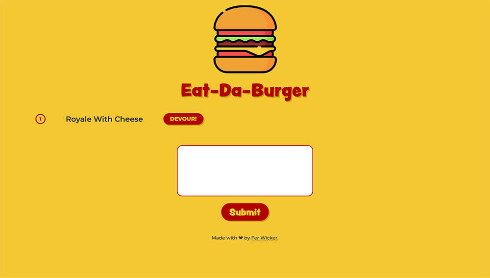

# Eat-Da-Burger!
This full stack web application uses a remote server and database to manage a list of burgers submitted by users. The users can interact with the front end to create new items in the database and update existing items.
[See deployed application.](https://shrouded-brook-04183.herokuapp.com/)
[See project page on my portfolio.](https://ferwicker.github.io/portfolio/projects/eat-da-burger/)

 # Table of contents
 - [Motivation](#motivation)
 - [Process](#process)
 - [Built with](#built-with)
 - [Features](#features)
 - [Installation](#installation)
 - [Roadmap](#roadmap)
 - [Credits](#credits)

## Motivation
Who doesn't love a burger? If you live in Sydney like me, you'll know sydneysiders are obsessed with burgers, from simple classics made to perfection to crazy and monstruous creations that would put Super Size Me to shame. This application allows users to add burgers to a 'devour wishlist', once the burger is devoured, click the button to move the burger to the column of delicious burgers past. 

## Process
This application was built following the MVC model, using ORM to manage the database processes and Handlebars to display the HTML page.

## Built with
- [Node.js](https://nodejs.org/en/)
- [Express](https://expressjs.com/)
- [MySQL](https://www.mysql.com/)
- [Handlebars](https://handlebarsjs.com/)
- [Bootstrap](https://getbootstrap.com/)

## Features
The application retrieves the burgers from the database and displays them in their corresponding column using handlebars. The users can create new items by submitting the form, and modify existing items in the database with the Devour button, which changes the burgers 'devour' status from false to true.
###  [See deployed application.](https://shrouded-brook-04183.herokuapp.com/)

## Installation
To install this application locally, download the package, then run the `schema.sql` and `seed.sql` files included, and install the necessary dependencies by navigating to the application folder in your terminal and running `npm install`. Now you are ready, start the server from the folder using node `server.js` command. When the connection is established, visit `http://localhost:3000/` from your browser to go to the application.

## Roadmap
Future updates for this application include adding a delete button to the burger items, and adding the restaurant that the burgers come from, with the possibility to add the restaurants details and other burgers submitted from that restaurant.

## Credits
- Fonts sourced from [Adobe Fonts](https://fonts.adobe.com/)
- Burger Icon made by <a href="https://www.freepik.com" title="Freepik">Freepik</a> from <a href="https://www.flaticon.com/" title="Flaticon">www.flaticon.com</a>

- Burgers to devour examples were sourced from: https://www.theurbanlist.com/sydney/a-list/best-burgers-sydney